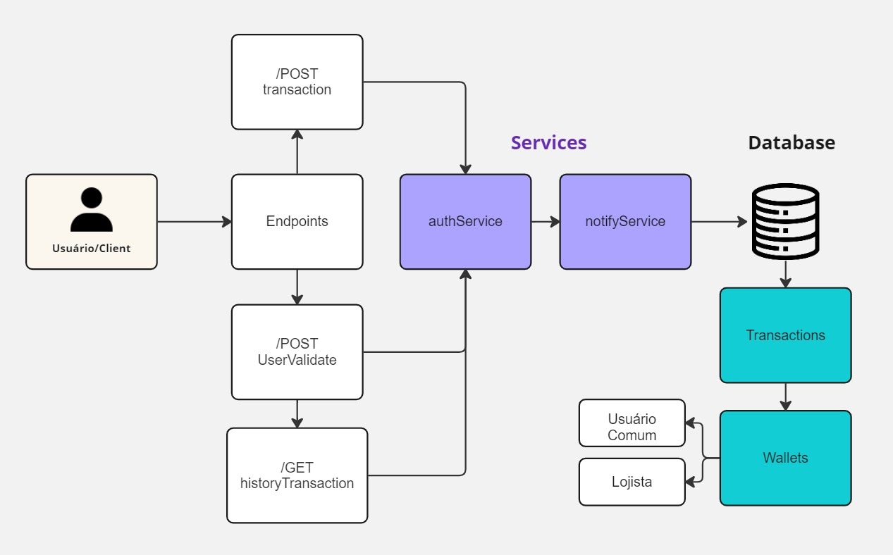
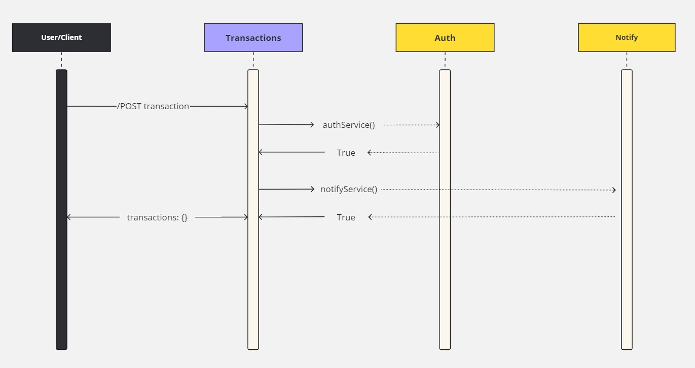

# PicPay Simplificado: Backend Sênior
Este projeto foi desenvolvido para resolver o desafio backend do PicPay Simplificado, voltado para o perfil Sênior. Inicialmente proposto para Java Spring, desafiei-me a implementar a aplicação em Python.

> Link: <a href="https://github.com/PicPay/picpay-desafio-backend?tab=readme-ov-file">Desafio Back-end PicPay</a> 


## Frameworks 🎈

- <a href="https://fastapi.tiangolo.com/">FastAPI</a>
- <a href="https://www.uvicorn.org/">Uvicorn</a>
- <a href="https://sqlitebrowser.org/">SQLite</a>
- Entre outros...

## Instalação 💤
- Clonar repositório git.

```bash
  git clone https://github.com/7Johnsz/PicPay-Simplificado.git
```

## Deploy
- Para fazer o deploy use a CLI do uvicorn.

```bash
  uvicorn main:app --reload --workers 
```

## Arquitetura




## 📝 License

This project is under license. See the [LICENSE](LICENSE) file for more details.
